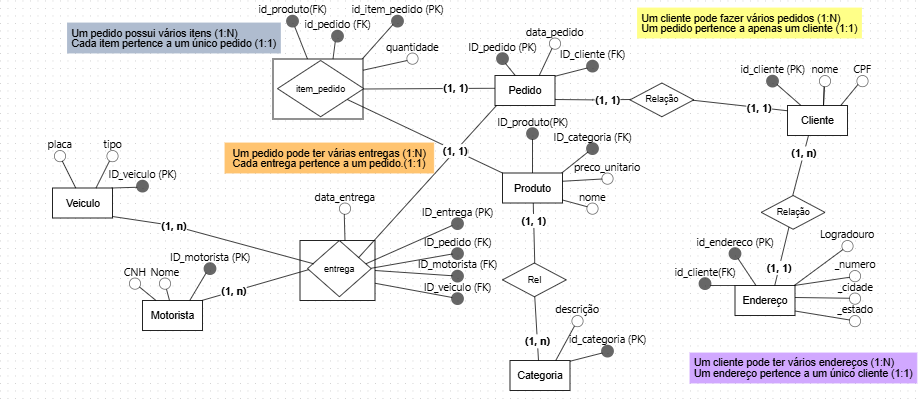
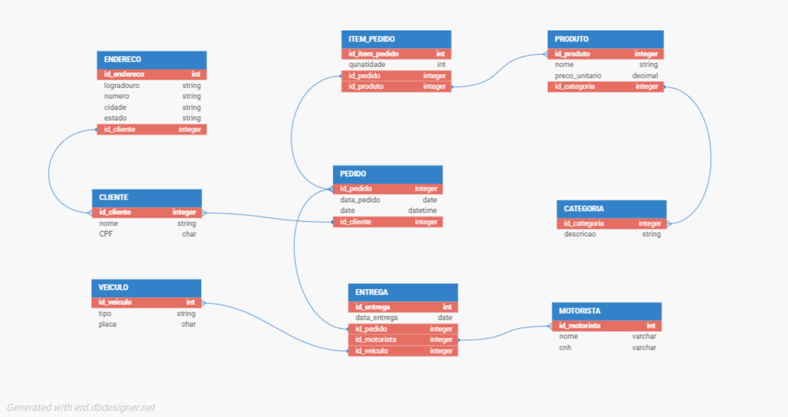
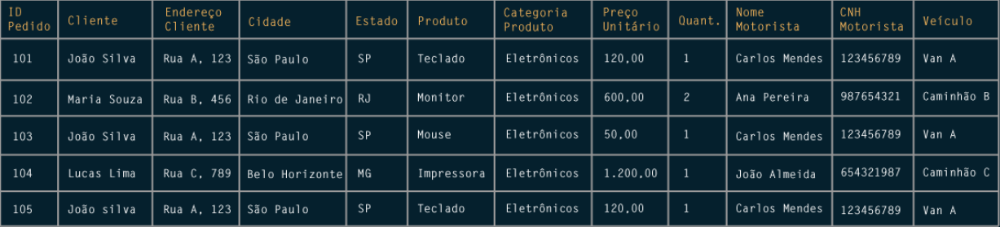

# Project Logística Refactor:


## 🛠️ Motivo da Refatoração:

Este projeto nasceu a partir de um projeto legado desenvolvido com foco exploratório e acadêmico. Embora o primeiro projeto tenha sido importante para validar a ideia, estudar a modelagem e construir os primeiros artefatos, ela apresentava limitações de organização e reprodutibilidade.

Entre os principais pontos identificados estavam o uso excessivo de notebooks como parte do fluxo principal, a criação de bancos de dados diferentes ao longo do desenvolvimento, inconsistências entre nomes de arquivos e comandos documentados, além da ausência de uma estrutura clara para instalação, execução e validação do projeto.

A refatoração foi iniciada para transformar o estudo em um projeto mais organizado, reproduzível e adequado para portfólio técnico. Neste projeto de refatoração, o objetivo é separar melhor as responsabilidades, padronizar o ambiente com Poetry, centralizar a criação do banco, registrar logs de execução, adicionar validações manuais e automatizadas, e documentar com mais clareza as decisões técnicas.


## 📌 Descrição Geral:

Este projeto tem como objetivo desenvolver uma aplicação para consulta e análise de dados logísticos normalizados.

O estudo parte de um cenário fictício em que uma empresa possui uma planilha de entregas originada de um ambiente transacional. A proposta é transformar esses dados em um modelo relacional normalizado, organizando as informações em entidades como clientes, endereços, categorias, produtos, pedidos, itens de pedido, entregas, motoristas e veículos.

A modelagem foi elaborada para garantir integridade referencial, normalização dos dados e preservação de informações históricas.

## 🎯 Objetivos

- Modelar um banco de dados relacional para um cenário logístico.
- Separar dados cadastrais e transacionais.
- Implementar modelos ORM com SQLAlchemy.
- Utilizar SQLite como banco local.
- Gerenciar dependências e ambiente com Poetry.
- Criar scripts utilitários para validação do banco.
- Demonstrar práticas de ETL (Extract, Transform and Load)
- Evoluir o projeto para um painel web com Streamlit.


## 📂 Estrutura do Projeto

```text
project_logistica_refactor/
├── data/
│   ├── raw/
│   ├── bronze/
│   └── silver/
├── scripts_utils/
├── src/
│   ├── database/
│   ├── etl/
│   └── models/
├── tests/
├── create_db.py
├── pyproject.toml
└── readme.md
```
## 🧠 Modelagem de Dados

O projeto foi estruturado a partir de um processo de modelagem em camadas, partindo da compreensão conceitual do domínio até a implementação física do banco relacional.

### 🧭 Modelo Conceitual

O Modelo Entidade-Relacionamento foi elaborado com base na notação de **Peter Chen** identificando entidades, atributos e relacionamentos de acordo com os requisitos do domínio logístico.
O modelo conceitual representa as principais entidades do cenário logístico e seus relacionamentos em alto nível.



### 🔗 Modelo Lógico

O modelo lógico foi construído segundo a abordagem relacional proposta por **James Martin**, realizando a transformação das entidades em tabelas, definição de chaves primárias e estrangeiras e normalização dos dados.
O modelo lógico transforma as entidades do domínio em tabelas relacionais, definindo chaves primárias, chaves estrangeiras e relacionamentos entre as estruturas.



### 🗂️ Amostra da Tabela Central

A tabela central original representa a visão transacional antes do processo de normalização.



---

### 🛢️ Modelo Físico:

O modelo físico foi implementado utilizando **SQLAlchemy**, respeitando as decisões tomadas nas etapas anteriores e aplicando regras de integridade diretamente no banco de dados.

Foram utilizadas:

- Chaves primárias simples
- Chaves estrangeiras
- Restrições de unicidade (`UniqueConstraint`)
- Regras de exclusão (`ON DELETE CASCADE` e `ON DELETE RESTRICT`)
- Relacionamentos ORM com `cascade="all, delete-orphan"` quando aplicável

---

## 🔐 Integridade Referencial e Regras de Exclusão:

As regras de exclusão foram definidas com base na dependência entre as entidades:

- **CASCADE** foi aplicado quando a entidade dependente não possui significado sem sua entidade principal:

  - Pedido → ItemPedido  
  - Pedido → Entrega  
  - Cliente → Endereço  

- **RESTRICT** foi utilizado para proteger dados históricos e de cadastro base:

  - Produto → ItemPedido  
  - Cliente → Pedido  
  - Motorista → Entrega  
  - Veículo → Entrega  

Além disso, o ORM SQLAlchemy foi configurado com `cascade="all, delete-orphan"` nos relacionamentos apropriados, garantindo a remoção automática de registros órfãos no nível da aplicação.


## 🧩 Tecnologias:

- Python
- Poetry
- SQLAlchemy
- SQLite
- Dbdesigner
- BRmodeler
- DB Browser
- Pandas
- OpenPyXL
- Streamlit
- Pytest
- Git e GitHub

## 📚 Considerações Finais

Este projeto demonstra, de forma integrada, a aplicação prática dos conceitos de modelagem de dados, desde o levantamento conceitual até a implementação física em um banco relacional.

A versão refatorada foi estruturada com foco em organização, reprodutibilidade e validação técnica. Para isso, foram utilizadas ferramentas como **Poetry**, para gerenciamento do ambiente virtual e das dependências; **SQLAlchemy**, para implementação do modelo físico por meio de ORM; **SQLite**, como banco relacional local; **logging**, para registro das instruções SQL executadas; e **Pytest**, para apoiar a validação automatizada da estrutura do banco.

A abordagem adotada prioriza a consistência dos dados, a preservação do histórico, a clareza estrutural e a rastreabilidade das decisões técnicas. Dessa forma, o projeto se torna adequado tanto para fins acadêmicos quanto para apresentação em portfólio técnico, servindo como base para as próximas etapas de ETL, análises e construção de uma aplicação web.

### 🐍 Ambiente Virtual: 

Instale as dependências com Poetry:

```poetry install```

### ⚙️⚙️ Ative o ambiente virtual no terminal:

```source .venv/Scripts/activate```

#### Ou execute comandos diretamente com Poetry:

```poetry run python nome_do_script.py```

#### 🛢️ Criação do Banco

Execute:
```
python create_db.py
```

### Ou:
```
poetry run python create_db.py
```

> *O arquivo database_logistic.db será criado localmente.*

### 🔎 Validações manuais:

```
Listar tabelas criadas:

- python scripts_utils/verificar_banco.py

Verificar colunas, tipos, nulidade e chaves primárias:

- python scripts_utils/verificar_schema.py

Verificar chaves estrangeiras:

- python scripts_utils/verificar_foreign_keys.py

Verificar se as foreign keys estão ativas no SQLite:

- python scripts_utils/verificar_sqlite_fk.py
```
### 🚦 Status da Versão:
```
A versão inicial contempla:

- configuração do projeto com Poetry
- estrutura inicial de diretórios
- conexão com SQLite
- ativação de chaves estrangeiras no SQLite
- modelos ORM com SQLAlchemy
- script de criação do banco
- scripts utilitários de validação
```

### 🧭 Próximos Passos:

- Criar testes automatizados.
- Implementar a camada Bronze.
- Implementar a camada Silver.
- Criar carga dos dados normalizados no banco.
- Desenvolver o painel web com Streamlit.


## 👤 Autor:

``` Daniel Martins França ```

## 📬 Contato:

- 📧 Email: [f.daniel.m@gmail.com](mailto:f.daniel.m@gmail.com)  
- 💼 LinkedIn: [www.linkedin.com/in/danixdev](https://www.linkedin.com/in/danixdev)  
- 📁 Trabalhos: [hwww.danixdev.blogspot.com/2026/01/normalizacao-de-dados-na-area-de.html](https://danixdev.blogspot.com/2026/01/normalizacao-de-dados-na-area-de.html)
